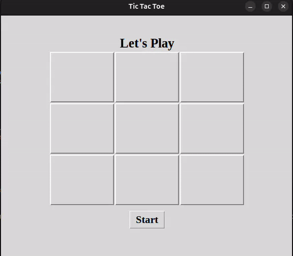

# Tic Tac Toe Game

A simple two-player Tic Tac Toe game built using the Tkinter Python module. This repository contains both a GUI-based and a console-based version of the game, allowing players to choose their preferred mode.

## Features

- User-friendly graphical interface (GUI version)
- Console-based gameplay (Console version)
- Two-player mode (X and O)
- Restart option to play again
- Simple design and easy to understand
- Responsive layout for different screen sizes (in GUI version)

## Requirements

To run this project, you'll need:

- Python 3.
- Tkinter (comes pre-installed with Python)

You can install the necessary packages using the following command:

```bash
pip install -r requirements.txt
```

## Installation

1. Clone the repository:

   ```bash
   git clone https://github.com/KushalRegmi61/TicTacToe-Game.git
   ```

2. Navigate to the project directory:

   ```bash
   cd TicTacToe-Game
   ```

3. Run the GUI version of the application:

   ```bash
   python guigame.py
   ```

   Or, if you want to play the console version:

   ```bash
   python consolegame.py
   ```

## Folder Structure

```
TicTacToe-Game/
│
├── consolegame.py       # Console-based Tic Tac Toe game
│   - A simple text-based implementation for two players to play Tic Tac Toe in the terminal.
│
├── guigame.py           # GUI-based Tic Tac Toe game
│   - A graphical implementation of the Tic Tac Toe game using Tkinter for a more interactive experience.
│
├── README.md            # Project documentation
└── requirements.txt     # List of required packages
```

## How to Play

1. Launch the application (choose either the console or GUI version).
2. The game randomly determines who goes first using the code:
   ```python
   turn = random.randint(0, 1)
   ```
   - If `turn = 0`, it's X's turn.
   - If `turn = 1`, it's O's turn.
3. The players take turns clicking on the cells of the grid (in the GUI version) or entering their moves (in the console version).
4. The game continues until one player wins or all cells are filled (resulting in a draw).
5. Click the "Restart" button (in the GUI version) to play again.

## Demo

Below is a demonstration of the Tic Tac Toe game, showcasing the gameplay mechanics and user interactions in both the GUI version.




